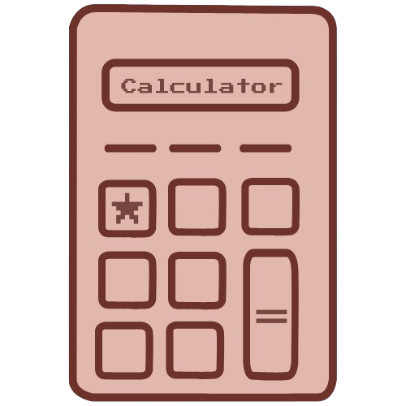
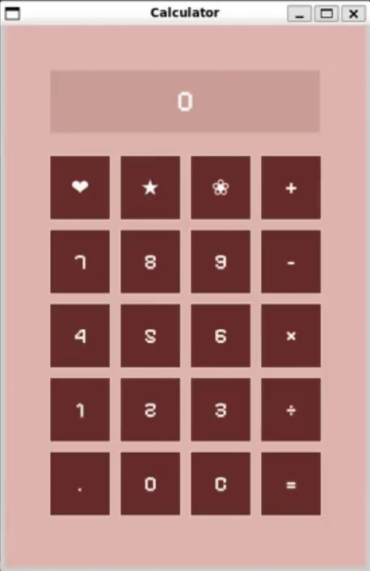

# Calculator [](https://www.codedex.org/challenges/september-2025-vibe-coding-challenge)

September 2025 Codédex Challenge: Vibe Coding Challenge ✨

A simple calculator application built with Python and Tkinter, featuring a cute and colorful design. 


## Features 


## Usage
Please install the font in the `./fonts` folder before running the application.
```shell
python calculator.py
```